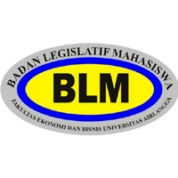

# Portal Resmi BLM FEB UNAIR 🏛️

Selamat datang di repositori resmi website **Badan Legislatif Mahasiswa Fakultas Ekonomi dan Bisnis Universitas Airlangga (BLM FEB UNAIR)**. 

Website ini berfungsi sebagai portal representasi mahasiswa untuk menampung partisipasi aktif dalam pengawasan, penyaluran aspirasi, serta advokasi yang berpihak pada kebutuhan mahasiswa FEB UNAIR.

## 🌟 Fitur Utama

- **Kotak Aspirasi Terintegrasi**: Memudahkan mahasiswa mengirimkan aspirasi, kritik, dan saran secara cepat dengan dukungan lampiran *file* lokal maupun tautan Google Drive.
- **Bank Aspirasi**: Halaman pemantauan untuk melihat *progress* atau tindak lanjut dari aspirasi yang telah masuk.
- **JDIH (Jaringan Dokumentasi dan Informasi Hukum)**: Pusat dokumentasi yang rapi dan terstruktur untuk mengakses produk-produk hukum seperti Konstitusi, Peraturan Mahasiswa, Peraturan Senat, SOP, Keputusan, dan Rancangan Peraturan.
- **Peminjaman Ruangan & Pengajuan Surat**: Sistem antarmuka yang mempermudah alur birokrasi bagi organisasi mahasiswa.
- **Desain Modern & Responsif**: Dibangun dengan antarmuka pengguna (UI) bergaya *glassmorphism* elegan yang dioptimalkan untuk perangkat Desktop maupun *Mobile*.

## 🛠️ Teknologi yang Digunakan

Website ini dibangun menggunakan teknologi *Frontend* modern dan ringan untuk memastikan kecepatan akses maksimal:
- **HTML5** & **CSS3** (Vanilla, untuk kontrol desain *pixel-perfect*)
- **Vanilla JavaScript** (Interaktivitas ringan tanpa *framework* berat)
- **BoxIcons** & **RemixIcons** (Ikonografi *User Interface*)
- **IziToast** (Sistem notifikasi dinamis)

## 🚀 Deployment

Proyek web statis ini dirancang agar dapat di-*hosting* dengan sangat mudah tanpa memerlukan konfigurasi *server backend* yang rumit. Website ini secara resmi di-*deploy* menggunakan **Vercel** untuk menjamin *uptime* dan kecepatan akses terbaik.

## 📬 Kontak

Badan Legislatif Mahasiswa  
Fakultas Ekonomi dan Bisnis, Universitas Airlangga  
Email: admin@blmfebunair.com

---
*Menyatukan Aspirasi, Menegakkan Demokrasi.*
